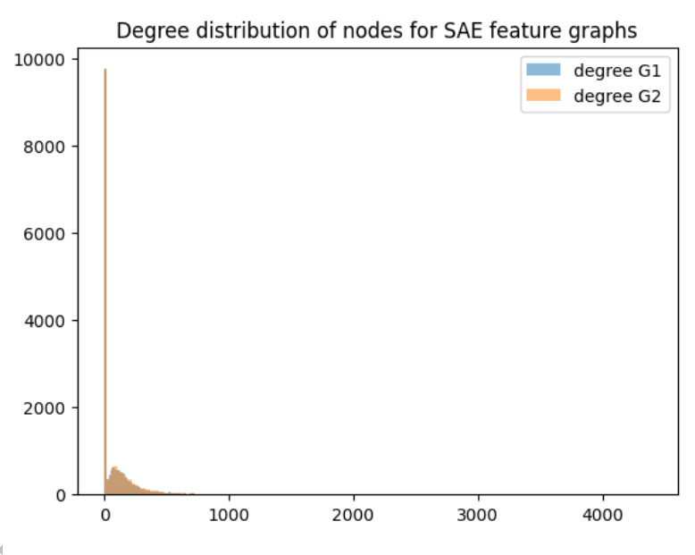
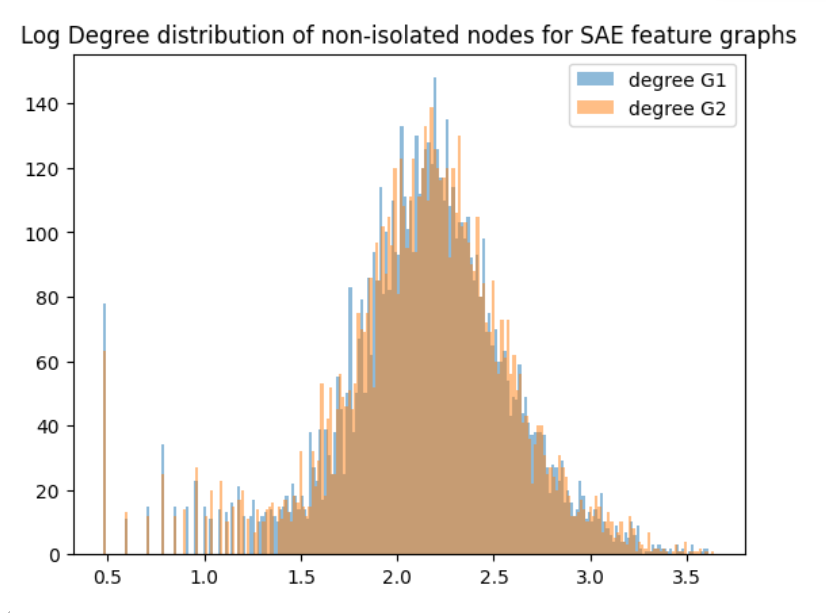
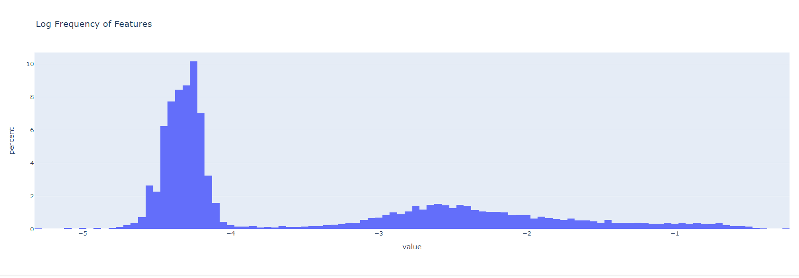
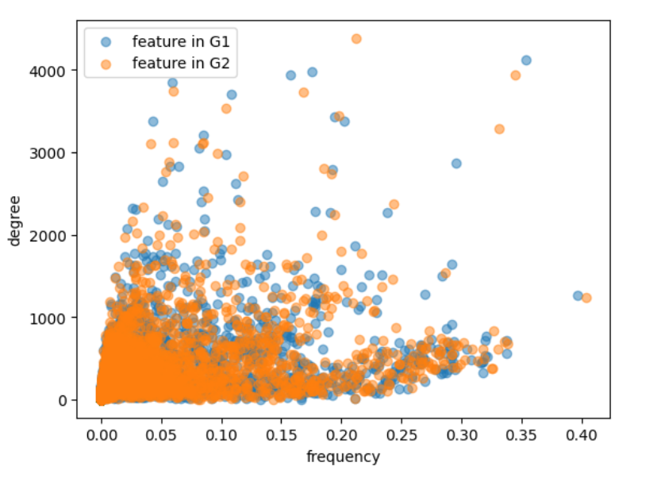

# SAE Feature Discovery using co-activation graphs

## Goal

## Minimal SAE background and motivation 

Autoencoders are used to extract encodings/representations from unlabelled data.

As the goal of Mechanistic Interpretability is to "reverse-engineer" the computations performed by a neural network, having a clean mapping between neurons and human-interpretable concepts would greatly facilitate our understanding of the model's internal processes.
Yet, as shown by works such as [Toy models of superposition](https://transformer-circuits.pub/2022/toy_model/index.html), [Finding Neurons In A Haystack](https://arxiv.org/pdf/2305.01610), LLMs superimpose neurons in order to represent as many different concepts as useful, resulting in polysemantic neurons.

By mapping the neuron activations to a larger space $\mathbb{R}^d_{ae\_hidden}$, $d_{ae\_hidden} > d_{mlp}$ and encouraging sparsity, the hope is that each dimension in $\mathbb{R}^{d_{ae_hidden}}$ corresponds to human interpretable features. This mapping is formed by training a sparse autoencoder on the regularised reconstruction loss.

### Problem Setup
Let $x \in \mathbb{R}^{d_{mlp}}$ be the MLP activations. 
Using an encoding matrix $W_{enc} \in \mathbb{R}^{d_{mlp} \times d_{ae\_hidden}}$, the autoencoder maps the neuron activactions $x$ (polysemantic features) into a larger space (ideally corresponding to interpretable monosematic features). 

The decoding matrix $W_{dec} \in \mathbb{R}^{d_{ae\_hidden} \times d_{mlp}}$ maps the features back to the MLP space as $\hat{x} \approx x$.

The reconstruction loss (plus an L2 and L1 regularization terms encoruaging sparsity) is used to train the autoencoder.

The typical workflow is to convert the input (text) to tokens, pass them through the transformer, recording the MLP activations for the specified layer.
The encodings (determined using the autoencoder) of these MLP activations are considered as SAE features and are used for interpetation.

## Analysis

### Creating the feature graph
The graph is defined as follows:

**Nodes:** the SAE features (i.e. the $d_{ae\_hidden}$ neurons of the SAE encoding layer)

**Edges:** for every token in the training dataset, the top $k$ active SAE features are linked with an edge, with the average (across the tokens in the batch) cosine similarity of their activation as edge weight

The used graphs are computed over the first 50 training data batches using $k=4$ top most active features.

#### Feature Degree vs Frequency

The distribution of feature frequency and feature degree is bimodal and the Pearson correlation between the two distributions is moderate (~0.51). Yet, a non-neglijable number of features have either low degree and high frequency or vice versa.

#### Descriptive statistics

Graph for SAE1:

`Number of nodes: 16384

Number of edges: 794239

Average degree: 96.95

Density: 0.0059

Number of connected components: 9411

Largest component size: 6974

Unique component sizes {1, 6974}

Average clustering coefficient: 0.1379
`

Graph for SAE2:

`Number of nodes: 16384

Number of edges: 795547

Average degree: 97.11

Density: 0.0059

Number of connected components: 9434

Largest component size: 6951

Unique component sizes {1, 6951}

Average clustering coefficient: 0.1373`

#### Usage example

